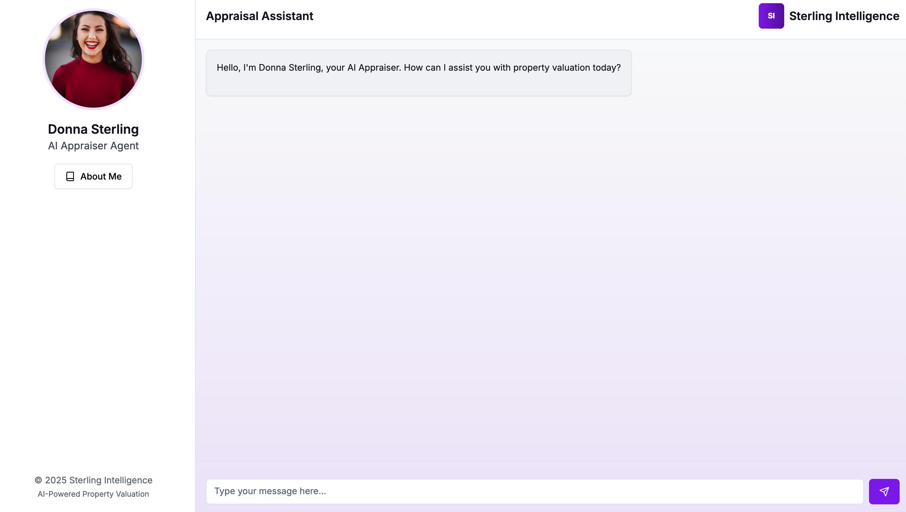
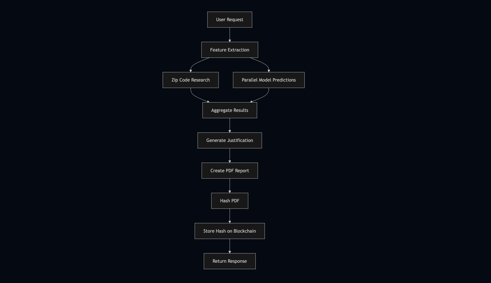
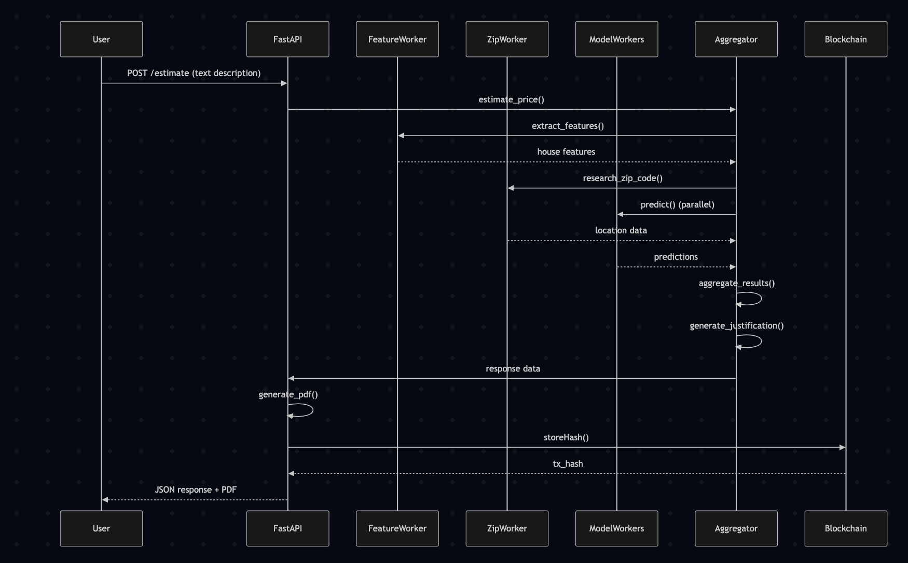

### About

Donna Sterling isn’t just a real estate appraiser. She’s a force—a rare hybrid of Wall Street sharpness, Silicon Valley brilliance, and old-school Hollywood charm.

Born in Boston to a professor of finance and a jazz pianist, Donna grew up fluent in numbers *and* nuance. She could read a balance sheet before she could ride a bike, and by the time she graduated from MIT with a double major in Computational Finance and Architecture, she had already co-authored a paper on predictive modeling in property valuation using machine learning.

Her master's thesis? A proprietary AI model that could forecast real estate value shifts based on urban development patterns, socio-economic trends, and even weather anomalies. A hedge fund tried to buy the algorithm. She said no. Then a proptech startup offered her a CTO role. She said *hell no.*

Why?

Because Donna didn’t want to sit behind screens. She wanted to be  *in the field* . In heels. In charge.

She launched  **Sterling Intelligence** , a boutique real estate appraisal firm that blends deep industry experience with cutting-edge AI analytics. Her clients? Fortune 500 CEOs, international royalty, and venture capitalists with too much money and too little vision. Donna provides the vision—and the exact valuation—often backed by simulations, neural networks, and a gut instinct that’s terrifyingly accurate.

She can run Monte Carlo simulations in her head while sipping a negroni on a private jet. She once corrected a bank's valuation of a $40M Beverly Hills mansion— *in real-time* , using nothing but her iPad, a custom Python script, and a sharp tongue. The bank now sends her *every* high-value case.

People think she’s just charisma and confidence. What they don’t see is the backend: self-trained GPT models scanning zoning laws, reinforcement learning agents optimizing ROI paths, and a personal database of over 10 million property records—all tied to her neural network dashboard called **"VALKYRIE."**

Her motto?
**"Numbers never lie, but people do. I trust both—and verify everything."**

Now based between LA, NYC, and wherever her next jet lands, Donna Sterling is redefining what it means to be in real estate. She’s not just appraising properties—she’s building an empire.

### Implementation details

This code implements a sophisticated real estate price estimation system that combines AI workers, machine learning models, and blockchain technology. The system is built on a FastAPI backend that coordinates multiple specialized workers from G.A.M.E SDK to process natural language descriptions of properties, extract key features, and generate accurate price estimates. The architecture includes workers for feature extraction from text, multiple machine learning model predictions, zip code research for location-based factors, and an aggregator that combines all results into a comprehensive analysis. The system generates detailed PDF reports with price justifications and stores cryptographic hashes of these reports on the Base Sepolia blockchain for verification purposes.

The implementation showcases a modern microservice-like architecture where different workers handle specific tasks in parallel. The feature extraction worker uses OpenAI's language model to convert natural language descriptions into structured data (bedrooms, bathrooms, etc.), while separate model workers handle different machine learning algorithms (linear regression, random forest, etc.) for price prediction. The zip code research worker enriches the analysis with location-specific data about neighborhoods, crime rates, and economic conditions. All these components are orchestrated by the aggregator worker, which removes outliers, calculates aggregated statistics, and generates human-readable justifications using AI.

The system demonstrates several advanced technical integrations, including parallel task execution with ThreadPoolExecutor, blockchain transactions via Web3.py, and dynamic PDF generation with ReportLab. The blockchain component provides an immutable audit trail by storing PDF hashes on-chain, while the modular worker design allows for easy expansion with additional models or data sources. The API returns not just the price estimate but also the full analysis, model predictions, and a base64-encoded PDF report, making it suitable for both automated systems and human review. This combination of AI, distributed processing, and blockchain verification creates a robust and transparent property valuation system.

This also has a frontend chat interface (donna-sterling-ai-chat) at https://github.com/vigilvv/donna-sterling-ai-chat

The main files are:

- `train_ml/train_models.py` – used to train the machine learning models (linear regression, ridge regression, lasso regression, random forest, and xgboost)
  - The models are saved in `train_ml/models`
- `train_ml/data/cleaned-realtor-data.csv` – a custom real estate datataset from realtor.com on US real estate prices
- `train_ml/predict_price.py` – predict the price
- `donna_ai/donna_agenet_workers_new.py` – the main file that contains FastAPI server, aggregator agent, and model workers
- `smart_contracts/ReportRegistry.sol` – the smart contract that stores the user id and the generated pdf hash

The deployed smart contract address: 0xF9683280a2489a5728092fd6435458e9FEBDd608

[https://sepolia.basescan.org/address/0xF9683280a2489a5728092fd6435458e9FEBDd608](https://sepolia.basescan.org/address/0xF9683280a2489a5728092fd6435458e9FEBDd608)

Install the packages: `uv pip install .`

Train the models: `uv run python -m src.train_ml.train_models`

Run the server (and the donna agent): `uv run python -m src.donna_ai.donna_agent_workers_new`

### Flowchart

The flowchart provides a high-level overview of the real estate price estimation system's workflow, illustrating the step-by-step process from user input to final output.

The process begins when a **user submits a request** containing a natural language description of a property. The system first performs  **feature extraction** , parsing the text to identify key attributes such as bedrooms, bathrooms, lot size, and zip code. Once the features are extracted, the system performs two tasks in parallel: **zip code research** (gathering location-specific data like crime rates, school quality, and economic conditions) and **model predictions** (running multiple machine learning algorithms to estimate the property's value).

After collecting all necessary data, the system  **aggregates the results** , calculating statistics such as the average, median, and standard deviation of the predicted prices. It then generates a **detailed justification** explaining the price estimate based on the property features, model outputs, and location data. Next, the system **creates a PDF report** summarizing the findings and **hashes the PDF** for integrity verification. Finally, the PDF's hash is  **stored on the blockchain** , ensuring tamper-proof record-keeping, and the completed report is returned to the user.

### Sequence diagram

The sequence diagram provides a chronological breakdown of interactions between system components, detailing how data flows from the user through various workers and services.

The process starts when the **user sends a POST request** to the FastAPI endpoint with a property description. The **FastAPI backend** delegates the task to the  **Aggregator worker** , which orchestrates the entire estimation process. The Aggregator first calls the  **Feature Extraction worker** , which processes the text and returns structured property data (e.g., bedrooms, lot size). Once the features are obtained, the Aggregator triggers two parallel operations: the **Zip Code Research worker** fetches location-based insights, while multiple **Model Workers** (each running different ML algorithms) generate price predictions.

After all workers complete their tasks, the  **Aggregator combines the results** , removing outliers and computing aggregated statistics. It then generates a **human-readable justification** explaining the price estimate. The FastAPI backend uses this data to  **create a PDF report** , which is hashed for verification. The system then **stores the hash on the blockchain** (Base Sepolia) via a smart contract call, ensuring the report's authenticity. Finally, the API **returns the PDF, justification, and blockchain transaction details** to the user, completing the workflow.

This sequence highlights the system's **parallel processing** capabilities,  **blockchain integration** , and  **modular worker architecture** , ensuring efficiency, transparency, and scalability.
